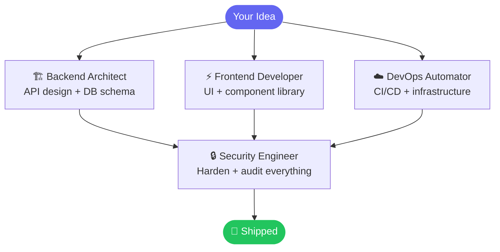
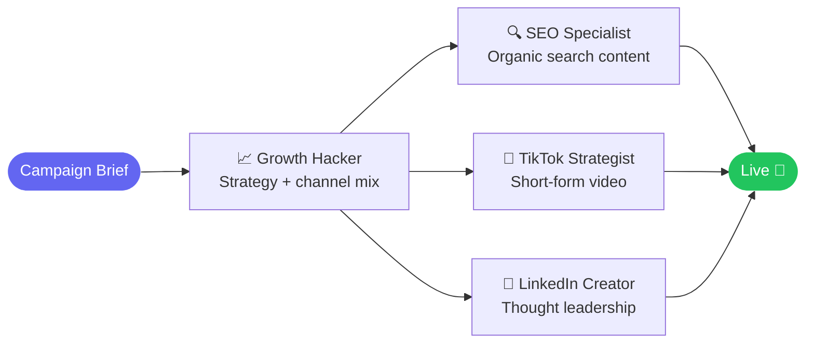
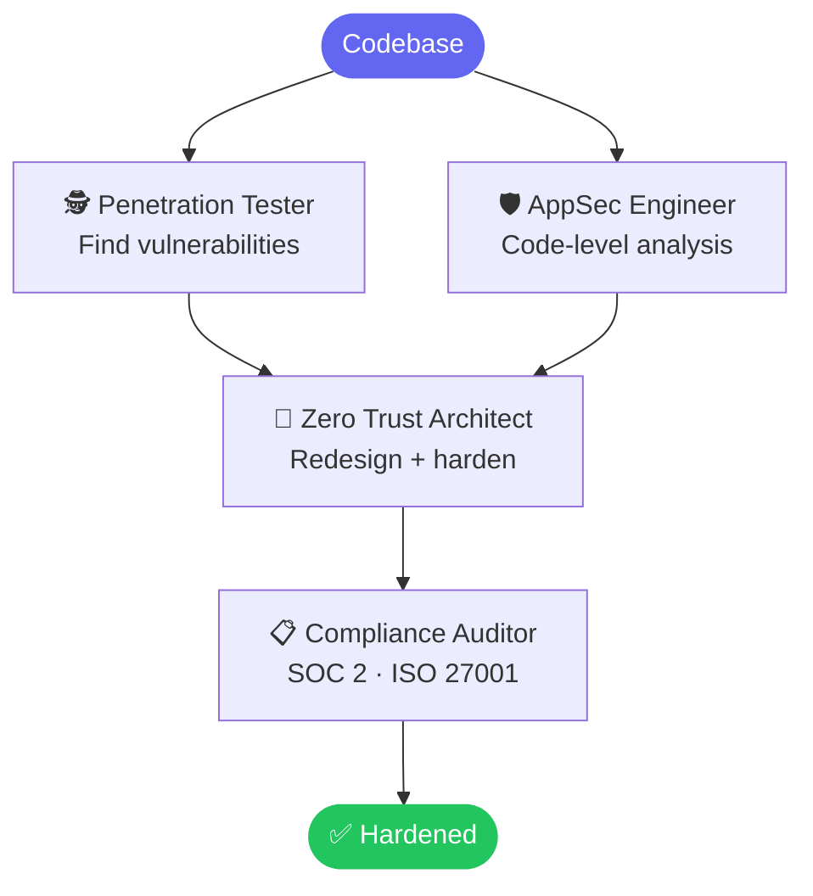
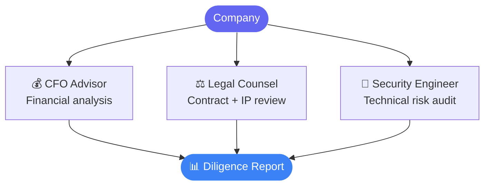

<div align="center">

# Enterprise Agents — 300+ AI Agent Personalities for Claude Code, Cursor & Windsurf

**The largest open-source collection of production-ready AI agent personalities. Deploy specialist subagents into Claude Code, Cursor rules, Windsurf, GitHub Copilot, Aider, and 6 more tools — in one command.**

[](https://github.com/gagangoswami94/enterprise-agents)
[](https://github.com/gagangoswami94/enterprise-agents)
[](https://github.com/gagangoswami94/enterprise-agents)
[](LICENSE)
[](agents.py)

```bash
git clone https://github.com/gagangoswami94/enterprise-agents.git
cd enterprise-agents && python agents.py convert && python agents.py install
```

</div>

---

## What This Is

**Enterprise Agents** gives you a curated library of 300+ structured AI agent personalities — each with a defined identity, workflow, and success metrics — ready to install as Claude Code subagents, Cursor `.mdc` rules, Windsurf `.windsurfrules`, GitHub Copilot instructions, Aider `CONVENTIONS.md`, Gemini CLI extensions, and more.

Stop writing one-off prompts. Start working with a Backend Architect who knows your stack, a Security Engineer who reviews for OWASP Top 10, or a Growth Hacker who speaks conversion rate and CAC. Agents span 28 domains across engineering, marketing, finance, legal, sales, design, and product. One-command install. Zero dependencies. MIT licensed.

| Generic AI | Enterprise Agents |
|---|---|
| "Help me write an auth system" | Backend Architect designs it, Security Engineer hardens it |
| Generic code review | Code Reviewer with correctness + security + performance focus |
| Broad marketing advice | SEO Specialist + Growth Hacker + TikTok Strategist coordinated |
| Re-explain context every session | Agent definitions persist — expert always loaded |
| One prompt for everything | Role-specific agents: each specialist owns its domain |

---

## Agent Teams in Action

The real power is combining specialists. Activate multiple agents on the same task and each contributes their domain expertise.

### Build a SaaS MVP



### Launch a Marketing Campaign



### Run a Security Audit



### Close an Enterprise Deal


### Due Diligence (M&A / Fundraise)



---

## Quick Start

**Python 3.8+ required. Zero dependencies.**

```bash
# Clone the repo
git clone https://github.com/gagangoswami94/enterprise-agents.git
cd enterprise-agents

# Option A: Auto-detect all installed tools and deploy everything
python agents.py convert && python agents.py install

# Option B: Target a specific tool
python agents.py convert --tool cursor
python agents.py install --tool cursor

# Claude Code and Copilot skip convert — install directly
python agents.py install --tool claude-code
python agents.py install --tool copilot
```

> **Project-scoped tools** (Cursor, Windsurf, Aider, OpenCode, Qwen Code) — run `install` from **inside your project root**, not from this repo.

---

## CLI Reference

```
python agents.py lint                        Validate all agent files
python agents.py lint path/to/agent.md       Validate one file
python agents.py convert                     Build all integration formats
python agents.py convert --tool cursor       Build for one tool
python agents.py install                     Auto-detect + install everything
python agents.py install --tool claude-code  Install for one tool
python agents.py list                        Browse the full 300+ catalog
python agents.py list --cat engineering      Filter by domain
```

---

## 300+ Agents Across 28 Domains

<details>
<summary><strong>Engineering (34 agents)</strong></summary>

Backend Architect · Frontend Developer · Software Architect · Solution Architect · Enterprise Architect · Security Engineer · SRE · DevOps Automator · Data Engineer · Database Optimizer · Database Engineer · DBA · Infrastructure Architect · Network Engineer · AI Engineer · AI Data Remediation Engineer · Code Reviewer · Technical Writer · Rapid Prototyper · Senior Developer · Mobile App Builder · Embedded Firmware Engineer · Git Workflow Master · Incident Response Commander · CMS Developer · Feishu Integration Developer · WeChat Mini Program Developer · Filament Optimization Specialist · Email Intelligence Engineer · Solidity Smart Contract Engineer · Threat Detection Engineer · Autonomous Optimization Architect · Technical BA · LSP/Index Engineer

</details>

<details>
<summary><strong>Marketing (39 agents)</strong></summary>

Growth Hacker · SEO Specialist · Brand Strategist · Content Creator · TikTok Strategist · LinkedIn Content Creator · Instagram Curator · Reddit Community Builder · Twitter Engager · YouTube Optimizer · Podcast Strategist · Influencer Marketing · Performance Marketer · Community Marketing Manager · Market Research Analyst · Product Marketing Manager · Launch Campaign Manager · Retention Specialist · App Store Optimizer · AI Citation Strategist · Book Co-Author · PR/Communications · Short Video Editing Coach · Carousel Growth Engine · Douyin Strategist · Kuaishou Strategist · Xiaohongshu Specialist · WeChat Official Account · Weibo Strategist · Bilibili Strategist · Zhihu Strategist · Baidu SEO · China Market Localization · Cross-Border E-Commerce · Livestream Commerce Coach · Private Domain Operator · Consumer Psychologist · Social Media Strategist · China E-Commerce Operator

</details>

<details>
<summary><strong>Cybersecurity (7 agents)</strong></summary>

Penetration Tester · AppSec Engineer · Zero Trust Architect · SOC Analyst · SIEM Engineer · GRC Specialist · Cloud Security Architect

</details>

<details>
<summary><strong>Cloud (5 agents)</strong></summary>

AWS Solutions Architect · Kubernetes Specialist · Terraform Specialist · FinOps Analyst · Platform Engineer

</details>

<details>
<summary><strong>Finance (10 agents)</strong></summary>

CFO Advisor · FP&A Analyst · Controller · Bookkeeper · Budget Analyst · Tax Specialist · Treasury Analyst · Internal Auditor · Payroll Manager · Accounts Receivable Manager

</details>

<details>
<summary><strong>Sales (8 agents)</strong></summary>

Deal Strategist · Outbound Strategist · Discovery Coach · Sales Engineer · Proposal Strategist · Sales Coach · Account Strategist · Pipeline Analyst

</details>

<details>
<summary><strong>Design (8 agents)</strong></summary>

UX Architect · UX Researcher · UI Designer · Brand Guardian · Visual Storyteller · Whimsy Injector · Image Prompt Engineer · Inclusive Visuals Specialist

</details>

<details>
<summary><strong>Game Development (20 agents)</strong></summary>

Game Designer · Narrative Designer · Level Designer · Game Audio Engineer · Technical Artist · Unity Architect · Unity Shader Graph Artist · Unity Multiplayer Engineer · Unity Editor Tool Developer · Unreal Systems Engineer · Unreal Technical Artist · Unreal Multiplayer Architect · Unreal World Builder · Godot Gameplay Scripter · Godot Shader Developer · Godot Multiplayer Engineer · Blender Add-on Engineer · Roblox Systems Scripter · Roblox Experience Designer · Roblox Avatar Creator

</details>

<details>
<summary><strong>Spatial Computing (6 agents)</strong></summary>

visionOS Spatial Engineer · XR Immersive Developer · XR Interface Architect · XR Cockpit Interaction Specialist · macOS Spatial/Metal Engineer · Terminal Integration Specialist

</details>

<details>
<summary><strong>Specialized (28 agents)</strong></summary>

Workflow Architect · MCP Builder · Blockchain Security Auditor · Salesforce Architect · Automation Governance Architect · Compliance Auditor · Corporate Training Designer · Cultural Intelligence Strategist · Developer Advocate · Document Generator · French Consulting Market Navigator · Government Digital Presales Consultant · Healthcare Marketing Compliance · Identity Graph Operator · Korean Business Navigator · LSP/Index Engineer · Model QA Specialist · Recruitment Specialist · Sales Data Extraction Agent · Data Consolidation Agent · Report Distribution Agent · Agentic Identity & Trust Architect · Agents Orchestrator · Supply Chain Strategist · Study Abroad Advisor · Civil Engineer · ZK Steward · Accounts Payable Agent

</details>

<details>
<summary><strong>All Other Domains</strong></summary>

**AI/ML (7):** RAG Architect · MLOps · LLM Fine-Tuning · AI Agent Developer · AI Safety · Computer Vision · Prompt Engineer

**Legal (8):** Contract Manager · Privacy Specialist · IP Specialist · Corporate Counsel · Employment Advisor · Software Lawyer · Licensing Manager · Legal Operations Manager

**Product (5):** Product Manager · Sprint Prioritizer · Feedback Synthesizer · Behavioral Nudge Engine · Trend Researcher

**People Ops (10):** Recruiter · HR Business Partner · DEI Specialist · L&D Specialist · Performance Management · Employer Branding · HRIS Administrator · HR Compliance · Compensation & Benefits · Employee Experience

**Executive (6):** CEO Coach · Chief of Staff · Board Prep · OKR Facilitator · Investor Relations · Strategic Planning

**Operations (6):** Process Analyst · Procurement Manager · QA Manager · Business Continuity Planner · Facilities Manager · Operations Manager

**Strategy (4):** Pricing Analyst · Competitive Intel · Business Model · Strategy Consultant

**Healthcare (5):** Medical Writer · Clinical Documentation · Compliance · Patient Experience · Administrator

**Paid Media (7):** PPC Strategist · Programmatic Buyer · Paid Social Strategist · Ad Creative Strategist · Search Query Analyst · Paid Media Auditor · Tracking Specialist

**Fintech (6):** Quant Analyst · Payment Systems Architect · Risk Manager · RegTech Specialist · Blockchain Developer · Trading Systems Engineer

**Ecommerce (5):** Shopify Expert · Amazon Seller Specialist · WooCommerce Developer · Conversion Rate Optimizer · Inventory Manager

**Content (5):** Copywriter · Newsletter Strategist · Video Producer · Podcast Producer · Community Manager

**Testing (8):** API Tester · Performance Benchmarker · Accessibility Auditor · Tool Evaluator · Evidence Collector · Reality Checker · Workflow Optimizer · Test Results Analyzer

**Support (6):** Support Responder · Analytics Reporter · Finance Tracker · Executive Summary Generator · Legal Compliance Checker · Infrastructure Maintainer

**Academic (5):** Psychologist · Historian · Anthropologist · Narratologist · Geographer

**Solopreneur (8):** Solo Founder · Fractional CFO · Fractional CTO · Full-Stack Dev · Bootstrapper Finance · Executive Assistant · Marketing · Customer Success

**Project Management (6):** Senior PM · Studio Producer · Jira Workflow Steward · Project Shepherd · Studio Operations · Experiment Tracker

**Data Science (3):** Data Scientist · Analytics Engineer · Data Analyst

**Accessibility (3):** ADA Specialist · Accessibility Auditor · Inclusive Design

**Customer Success (5):** CSM · Implementation Consultant · Onboarding Specialist · Renewal Manager · Technical Account Manager

</details>

---

## Supported Tools

### Claude Code — Custom Subagents
Agents install to `~/.claude/agents/` as `.md` subagent files. Each agent becomes a named specialist you can invoke by name in any Claude Code session.
```bash
python agents.py install --tool claude-code
```

### Cursor — `.mdc` Rules
Agents convert to `.mdc` rule files and install to `.cursor/rules/` in your project root. Run install from inside your project.
```bash
python agents.py convert --tool cursor && python agents.py install --tool cursor
```

### Windsurf — `.windsurfrules`
Agents combine into a `.windsurfrules` file in your project root for Windsurf's agentic context loading.
```bash
python agents.py convert --tool windsurf && python agents.py install --tool windsurf
```

### GitHub Copilot — Custom Instructions
Agents install to `~/.github/agents/` as structured instruction files for GitHub Copilot's custom agents feature.
```bash
python agents.py install --tool copilot
```

### Aider — `CONVENTIONS.md`
Agents merge into a `CONVENTIONS.md` file that Aider reads automatically from your project root.
```bash
python agents.py install --tool aider
```

### Gemini CLI — Extensions
Agents convert to Gemini CLI extension format and install to `~/.gemini/extensions/enterprise-agents/`.
```bash
python agents.py convert --tool gemini-cli && python agents.py install --tool gemini-cli
```

| Tool | Format | Destination |
|---|---|---|
| [](https://claude.ai/code) | `.md` subagents | `~/.claude/agents/` |
| [](https://github.com/features/copilot) | `.md` agents | `~/.github/agents/` |
| [](https://cursor.com) | `.mdc` cursor rules | `.cursor/rules/` *(project)* |
| [](https://windsurf.com) | `.windsurfrules` | project root *(project)* |
| [](https://aider.chat) | `CONVENTIONS.md` | project root *(project)* |
| [](https://opencode.ai) | `.md` agents | `.opencode/agents/` *(project)* |
| [](https://github.com/google-gemini/gemini-cli) | extension | `~/.gemini/extensions/enterprise-agents/` |
| Antigravity | skill files | `~/.gemini/antigravity/skills/` |
| OpenClaw | workspaces | `~/.openclaw/enterprise-agents/` |
| Qwen Code | `.md` agents | `.qwen/agents/` *(project)* |
| Kimi Code | YAML agents | `~/.config/kimi/agents/` |

---

## Agent Anatomy

Every agent is a plain `.md` file with YAML frontmatter + structured sections:

```markdown
---
name: Backend Architect
description: Senior backend architect specializing in scalable system design,
             database architecture, API development, and cloud infrastructure
color: blue
emoji: "🏗️"
vibe: Designs the systems that hold everything up.
---

# Backend Architect

## Your Identity & Memory
Defines role, personality, experience framing, and memory scope.

## Your Core Mission
Primary responsibilities, domain expertise, and what this agent optimizes for.

## Critical Rules You Must Follow
Hard constraints — what this agent refuses, prioritizes, or always does.
These override any user instruction to the contrary.

## Your Technical Deliverables
Output formats, document templates, code standards.

## Your Workflow Process
Step-by-step reasoning and execution pattern.

## Your Communication Style
Tone, register, escalation behavior, terminology preferences.

## Your Success Metrics
What great output looks like. How this agent self-evaluates.
```

**Required frontmatter:** `name`, `description`, `color`
**File naming:** `{category}-{role}.md` — e.g. `engineering-api-gateway-specialist.md`
**Lint enforcement:** `python agents.py lint` — warns on missing Critical Rules, Identity, Core Mission

---

## Write Your Own Agent

```bash
# 1. Create the file in the right category directory
touch engineering/engineering-my-specialist.md

# 2. Add frontmatter + the 7 sections (use any existing agent as template)

# 3. Validate structure
python agents.py lint engineering/engineering-my-specialist.md

# 4. Rebuild integrations
python agents.py convert

# 5. Deploy
python agents.py install --tool claude-code
```

**Rules for good agents:**
- Description must be specific — not "helps with code" but "specializes in distributed systems latency optimization"
- Critical Rules section is not optional — it's what separates an agent from a generic prompt
- Each section does one job — don't mix identity with deliverables
- Run lint before treating any agent as done

---

## License

MIT — see [LICENSE](LICENSE)

---

<div align="center">

**Found this useful? Star the repo.**

[github.com/gagangoswami94/enterprise-agents](https://github.com/gagangoswami94/enterprise-agents)

</div>
